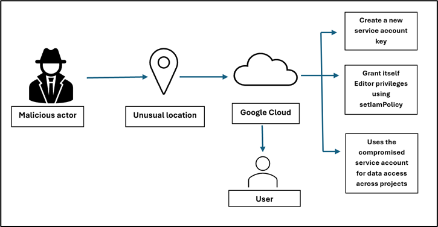

# Artifact Exploration and IAM Compromise


## Overview


In this lab, you investigate a stealthy IAM compromise using Kibana and Elasticsearch.

You analyze authentication events, audit activity, and service account artifacts. You correlate evidence across multiple data views to reconstruct the attacker's timeline. This scenario focuses on identity abuse without malware or noisy exploits.

You map your findings to these MITRE ATT&CK techniques:

* T1078 – Valid Accounts
* T1098 – Account Manipulation
* T1550.001 – Use of Authentication Tokens
* T1078.004 – Cloud Accounts

### **What you'll learn**

In this lab, you learn how to perform the following tasks:

* Identify IAM-relevant telemetry in Kibana.
* Investigate authentication anomalies using behavioral context.
* Validate suspicious IAM policy changes with supporting evidence.
* Correlate service account key activity to confirm identity pivoting.

### **Prerequisites**

Before you start, you should be familiar with:

* Cloud IAM concepts and audit logging
* The MITRE ATT&CK framework
* Kibana Query Language (KQL)
* Basic RBAC and service account authentication


## Setup


**Before you click the Start Lab button**

Read these instructions carefully before starting the lab.

Labs are timed and you cannot pause them. When you click Start Lab, a timer starts and shows how long the lab environment is available to you.

This hands-on lab gives you access to a real investigation environment, not a simulation or demo. You receive temporary credentials that you use to sign in to Kibana for the duration of the lab.

To complete this lab, you need:

* Access to a standard internet browser (Chrome browser recommended).

<div><ql-infobox>

**Note:** Use an Incognito or private browser window to run this lab. This prevents conflicts with any existing sessions that may affect access to the lab environment.
</ql-infobox></div>

* Time to complete the lab is limited. Once you start the lab, you cannot pause it.

**How to start your lab and access Kiban**a

1. Click the **Start Lab** button.
2. In the left panel, locate the temporary **Username** and **Password** provided for this lab.
3. Click the **Open Kibana** button.

A new browser tab opens and displays the Kibana sign-in page.

<div><ql-infobox>

**Tip:** Keep the lab instructions and the Kibana page open in separate windows, side-by-side, to make investigation easier.
</ql-infobox></div>

4. On the Kibana sign-in page, paste the **Username** from the left panel.
5. Paste the corresponding **Password**.
6. Click **Log in**.

After a few moments, the Kibana interface loads and you can begin the investigation.

**Verify access to the lab environment**

After signing in, confirm that you have access to the investigation environment.

1. In Kibana, open **Discover**.
2. Open the **Data view** selector.

You should see the following data views:

* auth-logs
* audit-logs
* service-accounts
* iam-activity

**Expected result**

You successfully access Kibana and confirm that all required data views are available for the lab.


## Scenario


An attacker obtains valid credentials for a low-privilege cloud user. The attacker moves slowly to blend in with normal operations:

* Successful logins occur from multiple geographic locations.
* IAM policy changes happen in small steps and look operationally justified.
* An existing service account key is rotated or reused.
* The service account is later used to access sensitive resources through legitimate API calls.

Your goal is to determine whether this activity is normal administration or a coordinated identity-based attack. You do this by reconstructing the timeline from log evidence.




## Task 1. Explore the Kibana environment


In this task, you confirm what telemetry is available and how the investigation is organized. You use this context to avoid jumping to conclusions based on a single data source.

**Open Kibana and review data views**

1. Log in to Kibana using the provided credentials.
2. In the navigation menu, click **Discover**.
3. In Discover, open the **Data view** selector, and then review the available data views:

* auth-logs
* audit-logs
* service-accounts
* iam-activity

4. If available, click **Dashboard** or **Lens** to review high-level trends.

**Expected result**

You confirm which data views exist and how to pivot between them during an investigation.


## Task 2. Identify suspicious IAM policy updates


In this task, you find IAM policy changes that look valid but may be suspicious in context. You focus on elevated roles and timing relationships.

**Search for IAM policy updates**

1. In the navigation menu, click **Discover**.
2. For **Data view**, select **audit-logs**.
3. In the query bar, paste the following query, and then press ENTER.

```
event.action:"iam.policy.update"
```

4. Identify policy updates that involve elevated roles, such as:

* roles/owner
* roles/editor
* roles/storage.admin

5. For any candidate event, note the actor identity and timestamp.

<div><ql-infobox>

**Note:** A single IAM policy update is not enough to prove malicious activity. You validate it using authentication and service account evidence in later tasks.
</ql-infobox></div>

**Expected result**

You identify IAM policy updates that require validation through correlation.


## Task 3. Detect abnormal successful logins


In this task, you identify authentication anomalies that may indicate valid account abuse. You avoid treating every foreign login as malicious and focus on patterns.

**Search for successful logins outside Canada**

1. In the navigation menu, click **Discover**.
2. For **Data view**, select **auth-logs**.
3. In the query bar, paste the following query, and then press ENTER.

```
event.action:"user_login" 
and event.outcome:"success" 
and not geo.country_name:"Canada"
```

4. Review the results and identify accounts with:

* Multiple locations over a short period
* A location that does not match their baseline pattern

5. Note the usernames and timestamps that you want to validate.

**Expected result**

You identify candidate user accounts for deeper investigation and correlation.


## Task 4. Investigate service account key activity


In this task, you determine whether service account key operations support persistence or pivoting. You treat key rotation as potentially suspicious when it aligns with other anomalies.

**Search for service account key events**

1. In the navigation menu, click **Discover**.
2. For **Data view**, select **service-accounts**.
3. In the query bar, paste the following query, and then press ENTER.

```
event.action:"createServiceAccountKey" 
and actor.email:"bob@corp.com"
```

4. Identify:

* Which service account is involved
* Whether the key action aligns with earlier IAM updates or login anomalies
* Whether the service account appears in other datasets

**Expected result**

You identify service account key activity that could enable persistence or pivoting.


## Task 5. Trace compromised key usage across IAM activity


In this task, you validate whether a specific key is used to access sensitive resources. You focus on what the key does, not only that it exists.

**Search for activity associated with a key ID**

1. In the navigation menu, click **Discover**.
2. For **Data view**, select **iam-activity**.
3. In the query bar, paste the following query, and then press ENTER.

```
service.key_id:"key-99999"
```

4. Review:

* Actions performed using the key
* Resources accessed
* Whether the activity deviates from normal service account behavior

**Expected result**

You confirm whether service account activity supports attacker pivoting and resource access.


## Task 6. Reconstruct the attack timeline and document findings


In this task, you combine evidence into a defensible narrative. You build a timeline that explains the attacker's sequence of actions and why it is suspicious.

**Build a timeline and map techniques**

1. Identify the most likely initial access event (valid credential use).
2. Correlate authentication anomalies to IAM policy updates by timestamp.
3. Connect IAM changes to service account key activity.
4. Confirm sensitive resource access using service account usage evidence.
5. Map evidence to MITRE ATT&CK techniques:

* T1078 – Valid Accounts
* T1098 – Account Manipulation
* T1550.001 – Use of Authentication Tokens
* T1078.004 – Cloud Accounts

**Expected result**

You produce an investigation timeline supported by log evidence and MITRE mapping.


## Congratulations


You investigated a stealthy IAM compromise using Kibana and Elasticsearch. You correlated identity events across authentication, audit logs, and service account activity to reconstruct an attack narrative.

These skills transfer to other cloud investigations where attackers avoid malware and use legitimate identity operations.


