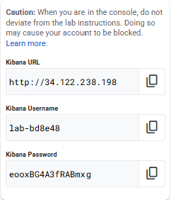

# Artifact Exploration and IAM Compromise


## Overview


In this lab, you investigate a stealthy IAM compromise using Kibana and Elasticsearch.

You analyze authentication events, audit activity, and service account artifacts. You correlate evidence across multiple data views to reconstruct the attacker's timeline. This scenario focuses on identity abuse without malware or noisy exploits.

You map your findings to these MITRE ATT&CK techniques:

* T1078 – Valid Accounts
* T1098 – Account Manipulation
* T1550.001 – Use of Authentication Tokens
* T1078.004 – Cloud Accounts

### **What you'll learn**

In this lab, you learn how to perform the following tasks:

* Identify IAM-relevant telemetry in Kibana.
* Investigate authentication anomalies using behavioral context.
* Validate suspicious IAM policy changes with supporting evidence.
* Correlate service account key activity to confirm identity pivoting.

### **Prerequisites**

Before you start, you should be familiar with:

* Cloud IAM concepts and audit logging
* The MITRE ATT&CK framework
* Kibana Query Language (KQL)
* Basic RBAC and service account authentication


## Setup


**Before you click the Start Lab button**

Read these instructions carefully before starting the lab.

* **Labs are timed.** When you click **Start Lab**, the timer starts immediately and shows how long your lab environment will remain available.
* **You cannot pause the lab.** Once the lab has started, the time continues to run until the session ends.
* This is a **simulation environment**. You will receive **temporary credentials** to sign in to Kibana for the duration of the lab.

To complete this lab, you need:

* Access to a standard internet browser (Chrome browser recommended).

<div><ql-infobox>

**Note:** Use an Incognito or private browser window to run this lab. This prevents conflicts with any existing sessions that may affect access to the lab environment.
</ql-infobox></div>

<div><ql-infobox>

**Note:** After clicking **Start Lab**, please allow **5 minutes** for the environment to fully initialize. During this time, the virtual machine, Elasticsearch, and Kibana services are starting and data is being ingested. If Kibana does not load immediately, wait a few minutes and refresh the page. The lab timer continues to run during initialization.
</ql-infobox></div>

**How to start your lab and access Kiban**a

1. Click **Start Lab** to launch your investigation environment.

On the left is the **Lab details** pane which is populated with the temporary credentials needed for this lab.



2. Wait for the environment to initialize. Allow **5 minutes** for Kibana to become accessible.
3. In the left panel, copy the **Kibana URL** provided.
4. Paste the URL into your browser and press **Enter**.
5. If you see a message saying **"This site doesn't support a secure connection"**, click **Continue to site** to proceed.
6. In the left panel, copy the **Kibana Username** and **Kibana Password**.
7. Paste the credentials into the login page and click **Log in**.
8. Dismiss initial warnings inside Kibana.

<div><ql-infobox>

**Tip:** Keep the lab instructions and the Kibana page open in separate windows, side-by-side, to make investigation easier.
</ql-infobox></div>

**Verify access to the lab environment**

After signing in, confirm that you have access to the investigation environment.

1. In Kibana, open **Discover**.
2. Open the **Data view** selector.

You should see the following data views:

* auth-logs
* audit-logs
* service-accounts
* iam-activity

**Expected result**

You successfully access Kibana and confirm that all required data views are available for the lab.


## Scenario


An attacker obtains valid credentials for a low-privilege cloud user. The attacker moves slowly to blend in with normal operations:

* Successful logins occur from multiple geographic locations.
* IAM policy changes happen in small steps and look operationally justified.
* An existing service account key is rotated or reused.
* The service account is later used to access sensitive resources through legitimate API calls.

Your goal is to determine whether this activity is normal administration or a coordinated identity-based attack. You do this by reconstructing the timeline from log evidence.


## Task 1. Explore the Kibana environment


In this task, you confirm what telemetry is available and how the investigation is organized. You use this context to avoid jumping to conclusions based on a single data source.

**Open Kibana and review data views**

1. Log in to Kibana using the provided credentials.
2. In the navigation menu, click **Discover**.
3. In Discover, open the **Data view** selector, and then review the available data views: auth-logs, audit-logs, service-accounts and iam-activity.
4. If available, click **Dashboard** or **Lens** to review high-level trends.

**Expected result**

You confirm which data views exist and how to pivot between them during an investigation.


## Task 2. Identify suspicious IAM policy updates


In this task, you find IAM policy changes that look valid but may be suspicious in context. You focus on elevated roles and timing relationships.

**Search for IAM policy updates**

1. In the navigation menu, click **Discover**.
2. For **Data view**, select **audit-logs**.
3.  Set time range: **Last 24 hours** (or Last 7 days)
4. In the query bar, paste the following query, and then press ENTER.

```
event.action:"setIamPolicy" and iam.change:"add"
```

5. Now narrow to **high-impact roles**:

```
event.action:"setIamPolicy" 
and iam.change:"add" 
and iam.role:("roles/owner" or "roles/editor" or "roles/storage.admin")
```

6. Identify suspicious candidates, and then note the following fields: `actor.email`, `@timestamp`, `iam.role`, `source.ip`, and `geo.country_name`.

<div><ql-infobox>

**Note:** A single IAM policy update is not enough to prove malicious activity. You validate it using authentication and service account evidence in later tasks.
</ql-infobox></div>

**Save your investigation step**

Save this query in Kibana using the **exact name**:

```
THL01-IAM-Policy-Updates
```

Click **Save** and confirm that the saved query appears in your list of saved searches.

**Expected result**

You identify IAM policy updates that require validation through correlation.


## Task 3. Detect abnormal successful logins


In this task, you identify authentication anomalies that may indicate valid account abuse. You avoid treating every foreign login as malicious and focus on patterns.

**Search for successful logins outside Canada**

1. In the navigation menu, click **Discover**.
2. Select Data view: **auth-logs**.
3. In the query bar, paste the following query, and then press ENTER.

```
event.action:"user_login" 
and event.outcome:"success" 
and not geo.country_name:"Canada"
```

4. Review the results, and then identify accounts that exhibit multiple geographic locations within a short time frame or behavior that deviates from their normal access pattern.
5. Note the usernames and timestamps that you want to validate.

**Save your investigation step**

Save this query in Kibana using the **exact name**:

```
THL01-Auth-Outside-Canada
```

Click **Save** and confirm that the saved query appears in your list of saved searches.

**Expected result**

You identify candidate user accounts for deeper investigation and correlation.


## Task 4. Investigate service account key activity


In this task, you determine whether service account key operations support persistence or pivoting. You treat key rotation as potentially suspicious when it aligns with other anomalies.

**Search for service account key events**

1. In the navigation menu, click **Discover**.
2. Select Data view: **service-accounts**.
3. In the query bar, paste the following query, and then press ENTER.

```
event.action:"createServiceAccountKey"
```

4. Now focus on suspicious actor:

```
event.action:"createServiceAccountKey" 
and actor.email:"bob@corp.com"
```

5. Identify the service account and key ID involved, note the timestamp, and then correlate this activity with the suspicious authentication events from Task 3 and the IAM policy changes from Task 2.

**Save your investigation step**

Save this query in Kibana using the **exact name**:

```
THL01-Service-Account-Key
```

Click **Save** and confirm that the saved query appears in your list of saved searches.

**Expected result**

You identify service account key activity that could enable persistence or pivoting.


## Task 5. Trace compromised key usage across IAM activity


In this task, you validate whether a specific key is used to access sensitive resources. You focus on what the key does, not only that it exists.

**Search for activity associated with a key ID**

1. In the navigation menu, click **Discover**.
2. Select Data view: **iam-activity**.
3. In the query bar, paste the following query, and then press ENTER.

```
service.key_id:"key-99999"
```

4. Review the results and determine the event action, the resources accessed, and the originating IP address and geographic location.
5. To isolate **download-like** behavior:

```
service.key_id:"key-99999" 
and event.action:("data_download" or "data_access" or "token_generate")
```

**Save your investigation step**

Save this query in Kibana using the **exact name**:

```
THL01-Key-Usage
```

Click **Save** and confirm that the saved query appears in your list of saved searches.

**Expected result**

You confirm whether service account activity supports attacker pivoting and resource access.


## Task 6. Reconstruct the attack timeline and document findings


In this task, you combine evidence into a defensible narrative. You build a timeline that explains the attacker's sequence of actions and why it is suspicious.

**Build a timeline and map techniques**

1. **Initial access**: suspicious logins (valid account):

Evidence: auth-logs (geo anomalies / short-window multi-country)

2. **Privilege escalation**: IAM role added (ex: roles/owner):

Evidence: audit-logs (event.action:setIamPolicy, iam.role:roles/owner, actor.email)

3. **Persistence / pivot**: service account key created

Evidence: service-accounts (createServiceAccountKey, service.key_id)

4. **Actions on objectives**: resource access + downloads

Evidence: iam-activity (service.key_id:key-99999 → token_generate → data_download)

5. Map evidence to MITRE ATT&CK techniques:

* T1078 – Valid Accounts (auth anomalies)
* T1098 – Account Manipulation (IAM role changes)
* T1550.001 – Use of Authentication Tokens (token_generate)
* T1078.004 – Cloud Accounts (service accounts + keys)

**Expected result**

You produce an investigation timeline supported by log evidence and MITRE mapping.


## Congratulations


You investigated a stealthy IAM compromise using Kibana and Elasticsearch. You correlated identity events across authentication, audit logs, and service account activity to reconstruct an attack narrative.

These skills transfer to other cloud investigations where attackers avoid malware and use legitimate identity operations.


